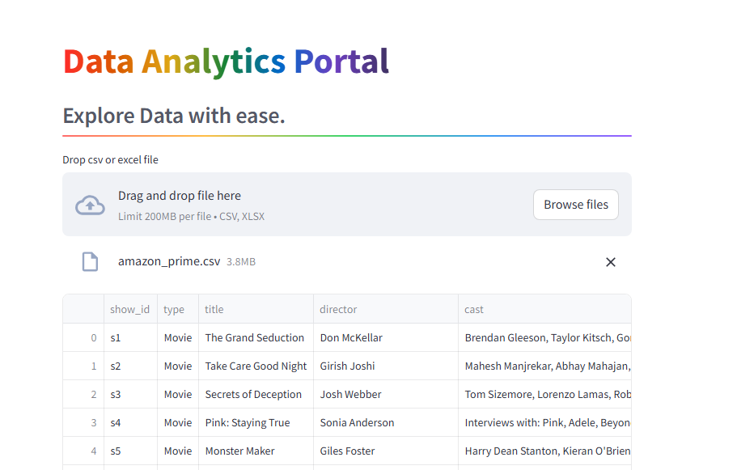

## Amazon Prime Video Data Analysis Project
## Project Overview
Amazon Prime Video is a globally renowned media and video streaming platform, offering a vast library of content, including movies and TV shows. As of mid-2021, the platform boasts over 10,000 titles and serves more than 200 million subscribers worldwide. This project delves into the extensive dataset of Amazon Prime's content catalog to gain valuable insights and present these findings in an interactive Power BI , Tableau dashboard.

Project Purpose

The primary objective of this project is to explore, analyze, and visualize the rich dataset of movies and TV shows available on Amazon Prime Video. By doing so, I aim to achieve the following:

Content Insights: Gain an understanding of the diversity and characteristics of the content, including details on the cast, directors, IMDb ratings, release years, and duration.

Trends and Patterns: Identify trends and patterns in the content library, both in terms of movies and TV shows, to uncover hidden insights.

Interactive Dashboard: Create an informative and user-friendly Power BI dashboard to allow users to interact with the data and discover insights that interest them.

About the Data

The dataset used in this project is a comprehensive tabular dataset that comprises listings of all the movies and TV shows available on Amazon Prime Video. It includes a wide array of attributes, such as directors, IMDb ratings, release years, description and duration. This dataset serves as the foundation for our analysis, enabling us to explore and draw meaningful conclusions about the content available on the platform.

Approach and Methodology

In this project, I utilized various data visualization techniques and Power BI to conduct our analysis and present our findings. The approach involved the following key components:

Data Preprocessing: Cleaning, transforming, and preparing the dataset for analysis. This step involved handling missing data, standardizing values, and ensuring data quality.

Visualization: Creation of an interactive Power BI dashboard featuring elements such as slicers, filled maps, stacked bar charts, donut charts, and KPI cards. These visualizations allowed us to present our insights in a visually compelling and user-friendly manner.

Insight Generation: Exploration of the dataset to uncover trends by country, IMDb ratings, release years, and other pertinent dimensions. I sought to answer questions such as the most common cast members, top directors, and changes in content over time.

User Interaction: The Power BI dashboard provides users with the opportunity to interact with the data and explore the insights most relevant to their interests.

Key Highlights

The project presents a wide array of insights, including but not limited to:

Content Distribution: The distribution of movies and TV shows by country, allowing us to identify the countries with the highest representation.

IMDb Ratings: A breakdown of content by IMDb ratings, enabling us to discern trends in content quality.

Historical Trends: Analysis of content trends over the years, including the distribution of content by release year.

Top Contributors: Identification of top directors, cast members, and other key contributors to the content library.

## Dashboard
 - Powerbi
](./Amazon_Sales%20With%20Powerbi.png
)
 - Tableau](./Amazon%20Prime.png)

 - Streamlit 
  

  ``` streamlit
   installl Streamlit library
   
   pip install streamlit 
```
```
 exec file: streamlit run Amazon.py
```